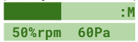

# Ventilation Controller
This manual will guide you through using the ventilation control system, including the web UI and the built-in liquid crystal display. You will also learn about the MQTT messages used to control the system.

### Table of Contents

1. [Modes](#modes)

    1.1 [Automatic mode (A)](#automatic-mode-a)
    1.2 [Manual mode (M)](#manual-mode-m)
    1.3 [Data/Debug mode (D)](#datadebug-mode-d)

2. [Web UI](#web-ui)

    2.1 [Auto toggle](#auto-toggle)
    2.2 [Target Pascals slider](#target-pascals-slider)
    2.3 [Fan Speed slider](#fan-speed-slider)
    2.4 [Data display](#data-display)
    2.5 [Graph display](#graph-display)
    2.6 [Target Pressure alert](#target-pressure-alert)

3. [Built-in LCD UI](#built-in-lcd-ui)

    3.1 [Buttons](#buttons)
    3.2 [Automatic Mode (A)](#automatic-mode-a-1)
    3.3 [Manual Mode (M)](#manual-mode-m-1)
    3.4 [Data/Debug Mode (D)](#datadebug-mode-d-1)

4. [MQTT](#mqtt)

    4.1 [Settings message](#settings-message)
    4.2 [Status message](#status-message)

## Modes

The controller has various modes to control the fan speed and to allow for easy adjustment. In the web UI the only available modes are automatic and manual, since data is always displayed via the display and graphs. Since the LCD has limited space for data we also provide a data/debug mode.

### Automatic mode (A)

The controller will adjust the fan speed to keep the pressure at the target value.

### Manual mode (M)

Allows you to control the fan speed manually. Ideal for when a constant fan speed is desired.

### Data/Debug mode (D)

Displays data on the LCD. The controller will not adjust the fan speed while this mode is active.

## Web UI
The web UI has the following features:

### Auto toggle

Press this toggle to switch between manual (OFF) and automatic (ON) modes.

#### Target Pascals slider

This slider sets the target pressure in pascals for automatic mode and is only visible when automatic mode is active.

### Fan Speed slider

This slider sets the fan speed to a percentage of the maximum speed for manual mode and is only visible when manual mode is active.

### Data display

Displays the current pressure in pascals, the current temperature in degrees celsius, the relative humidity as a percentage, and the current carbon dioxide level in parts per million.

### Graph display

Displays the same data as the data display, but graphed over time with the horizontal axis being time and the vertical axis being the relevant unit. You can hover over a point in a graph to see the exact value.

### Target Pressure alert

If automatic mode cannot reach the target pressure within a minute the UI will display a large red exclamation mark to alert the user of the malfunction.

## Built-in LCD UI

The built-in LCD UI has the following features:

### Buttons

The buttons on the LCD from top to bottom are as follows:
- Button 1: Mode switch, switches the mode in the following order when pressed: Data/Debug > Automatic > Manual
- Button 2: Unused. You can press it for fun or to look like you’re doing something important.
- Button 3: Increase (+) button. Increases the target pressure when in automatic mode and the fan speed when in manual mode. Does nothing in data/debug mode.
- Button 4: Decrease (-) button. Decreases the target pressure when in automatic mode and the fan speed when in manual mode. Does nothing in data/debug mode.
- Reset Button: This button is separate from the other buttons towards the left side. Pressing it will reset the ventilation controller in case of a malfunction.

### Automatic Mode (A)

Automatic mode is denoted by the letter A in the top right corner of the LCD. In this mode the LCD will display a bar denoting the set target pressure from 0Pa to 120Pa on the top row, with each block denoting roughly 8.6 Pa. The bottom row will display an average pressure in pascals, as well as the target pressure denoted by “Goal:”.

### Manual Mode (M)

Manual mode is denoted by the letter M in the top right corner of the LCD. In this mode the LCD will display a bar denoting the set fan speed from 0% to 100% on the top row, with each block denoting roughly 7%. The bottom row will display the currently set fan speed as a percentage, denoted on the display as “%rpm”, as well as the current pressure in pascals.

### Data/Debug Mode (D)

Data/Debug mode is denoted by the letter D in the top right corner of the LCD. In this mode the LCD will display the temperature in celsius as well as the relative humidity on the top row. The bottom row will display the carbon dioxide concentration in parts per million and the current pressure in pascals.

## MQTT

The controller can be controlled through a network via MQTT messages. It receives messages on the “controller/settings” topic and sends messages on the “controller/status” topic.

### Settings message

The settings message must be a JSON object with the following keys:
* auto: A boolean value that indicates whether the controller should be in automatic mode.
* fanSpeed: The fan speed as a percentage. This value is only required if auto is set to false.
* targetPa: The target pressure in pascals. This value is only required if auto is set to true. Here is an example of the settings message:

`{
“auto”: false,
“fanSpeed”: 100,
}`

or

`{
“auto”: false,
“targetPa”: 120,
}`

### Status message

The status message is a JSON object with the following keys:
* sampleNr: The number of times the controller has sampled the pressure since boot.
* fanSpeed: The current fan speed as a percentage of the maximum speed.
* targetPa: The target pressure in pascals.
* pressurePa: The current pressure in pascals.
* co2ppm: The current carbon dioxide level in parts per million.
* rHumidity: The relative humidity as a percentage.
* tempCelsius: The current temperature in degrees celsius.
* auto: A boolean value that indicates whether the controller is in automatic mode.
* error: An error code. If this value is non-zero, the controller is experiencing an error. Such as the target pressure being unreachable.

Here is an example of the status message:

`{
“sampleNr”: 1,
“fanSpeed”: 50,
“targetPa”: 60,
“pressurePa”: 50,
“co2ppm”: 300,
“rHumidity”: 33,
“tempCelsius”: 25,
“auto”: 1,
“error”: 0
}`